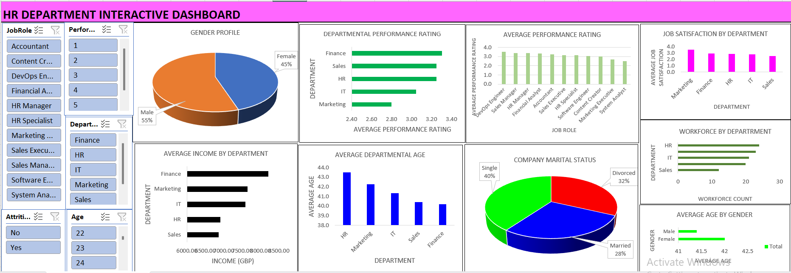

# HR Department Employee Insights
This interactive Excel HR dashboard offers insights into employee performance, satisfaction, demographics, and departments. It enables HR managers and business leaders to make data-driven decisions on workforce planning, engagement strategies, and optimizing organizational structure.

**Title:** [HR Department Employee Insights](https://github.com/Osiwi/github.io/blob/main/HR_Employee_Data%20Cleaned.xlsx)

**Tools & Technologies Used:** 
Microsoft Excel: Primary platform for dashboard development and data visualization.
Pivot Tables & Pivot Charts: Used to summarize and analyze metrics by department, job role, and demographic attributes.
Slicers & Filters: Enabled dynamic filtering by job role, department, age, attrition status, and performance rating.
Combo Charts & Pie Charts: Used to display categorical distributions and comparisons (e.g., gender profile, marital status).
Power Query (Get & Transform): Used to clean HR data before analysis.
Conditional Formatting: Applied to enhance data readability and highlight critical HR metrics.

**Project Description Overview:**
This interactive HR dashboard provides a comprehensive overview of employee performance, satisfaction, demographics, and departmental insights. Built in Excel, it supports HR managers and business leaders in making data-informed decisions about workforce planning, employee engagement, and organizational structure.

**Objective:**
To visualize and analyze HR data in an interactive format that reveals trends in performance ratings, job satisfaction, department-level workforce distribution, income, age demographics, and attrition risks—empowering the HR department to drive better people-management strategies.

**Key Features Included in the Dashboard:**
Gender Profile Distribution: Pie chart displaying the male-to-female workforce ratio (55% male, 45% female).
Departmental Performance Rating: Horizontal bar chart comparing performance across departments like HR, IT, Sales, and Finance.
Job Satisfaction by Department: Visual insight into which departments report higher or lower satisfaction levels.
Workforce Count by Department: Highlights employee distribution across departments.
Average Income by Department: Income analysis segmented by department, with Finance leading in compensation.
Average Performance by Job Role: Comparison of performance across roles such as DevOps, HR Manager, and Analyst.
Marital Status Profile: Breakdown of employees into Single (40%), Married (28%), and Divorced (32%).
Average Age by Gender and Department: Age analysis by department and gender to aid generational workforce planning.

**Key findings:**
Finance department leads in average performance and income, indicating a highly productive and well-compensated team.
Marketing has the lowest performance rating, suggesting potential training or restructuring needs.
HR has the highest average departmental age (~43.7 years), which may have implications for succession planning.
Single employees form the largest portion of the workforce (40%), which may influence benefit and engagement strategies.
Female employees are slightly younger on average than males, a useful metric for long-term workforce diversity planning.
IT and HR departments have the largest workforces, which may reflect organizational priorities or operational demands.
Summary:
This HR dashboard transforms employee data into a visually engaging, actionable tool that supports data-driven decision-making in people management. It provides insights across demographics, performance, and department-level trends; helping HR leaders proactively manage workforce development and employee well-being.

**Dashboard Overview:** 

